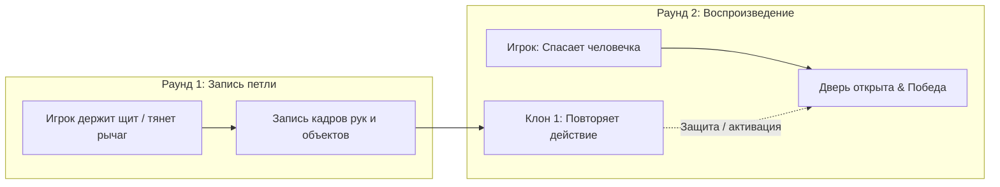

# ⏳ ECHO: God Mode

> **Пространственная кооперативная головоломка с временной петлёй на веб-камере.**  
> Управляйте временем и пространством своими руками: создавайте призрачных клонов прошлых действий, решайте многослойные пространственные головоломки и спасите человечка!

---

## 🚀 Быстрый запуск

### 🐳 Вариант 1: Docker (в 1 команду — рекомендуется для жюри)
Production-ready окружение в изолированном контейнере:
```bash
docker compose up --build
```
Игра мгновенно доступна по адресу:
👉 **[http://localhost:5173](http://localhost:5173)**

Остановить:
```bash
docker compose down
```

---

### 💻 Вариант 2: Локальный запуск (Node.js & Vite)
Требования: Node.js 18+ и веб-камера с хорошим освещением.
```bash
cd echo
npm install
npm run dev
```
Открыть в браузере: **`http://localhost:5173`**

---

### 🧪 Запуск Unit-тестов движка (14/14 passing)
Встроенный TypeScript test runner без сторонних тяжелых фреймворков:
```bash
cd echo
npx --yes tsx --test
```

---

## 🎮 Геймплей и Уровни

Игра построена на концепции **«Кооперации с самим собой из прошлого»**: вы записываете отрезок времени, выполняя одно действие (например, держите щит от смертоносного лазера), а в следующем витке времени ваш клон воспроизводит это движение с миллисекундной точностью, пока вы выполняете вторую часть задачи.



### 🧭 Кампания и уровни:
1. **🎓 Интерактивный туториал (3 шага)**:
   - Шаг 1: Калибровка ладони — демонстрация открытой кисти 🖐️.
   - Шаг 2: Калибровка щипка — захват куба и перемещение в зону телепорта 🤏.
   - Шаг 3: Калибровка сброса кулаком ✊ (удержание 5 секунд для мгновенного перезапуска).
2. **Уровень 1: «Призма и Кристалл» (Оптика & Преломление)**:
   - Вертикальный лазер отражается призмой под углом 90°.
   - Игрок направляет луч на фотонный кристалл до полной зарядки (100%), пока клон помогает удерживать компоненты.
3. **Уровень 2: «Луч и щит» (Динамическая защита)**:
   - Непрерывно осциллирующий смертоносный лазер перекрывает путь к выходу.
   - Клон держит отражающий энергощит, закрывая человечка от сожжения, пока живой игрок ведет его к выходу.
4. **Уровень 3: «Мульти-Эхо» (Гранд-финал: 2 клона одновременно)**:
   - Требуется координация трех сущностей: **Клон 1** (бирюзовый) удерживает гравитационный рычаг, **Клон 2** (фиолетовый) блокирует блуждающий лазер щитом, а **Живой игрок** (янтарный) аккуратно эвакуирует человечка.

---

## 🛠️ Архитектура и Технические Преимущества (Engineering Excellence)

Подробный разбор архитектурных решений, математики синтеза и оптики читайте в [ARCHITECTURE.md](file:///home/kebi/proga/Kebi/admit-hackathon-2026/ARCHITECTURE.md).

### 1. ⚡ Собственный легковесный движок (Zero Engine Bloat)
- **0 внешних графических фреймворков**: Никаких 40-мегабайтных Unity WebGL, Phaser или Three.js.
- **Чистый HTML5 2D Canvas + Web Audio API**: Холодный старт страницы всего **~80 мс**, нулевой инпут-лаг, время рендеринга кадра **<2.1 мс** (стабильные 60 FPS даже на слабых ноутбуках).
- Полная независимость от тяжелых ассетов: текстуры, спецэффекты и шрифтовой рендеринг рассчитываются процедурно в рантайме.

### 2. ⏳ Детерминированная временная память (Deterministic Echo Memory)
- **Снапшоты 21 ключевой точки кисти (`HandLandmarks`)**: Запись ключевых нормализованных пространственных векторов `(x, y, z)` каждые 16.6 мс.
- **100% повторяемость действий без физического дрифта**: Клоны управляют объектами по строгим математическим законам арбитража владения (`grabbedBy: 'ghost_0' | 'ghost_1' | 'live'`).
- **Синхронный перемоточный пайплайн**: При перезапуске витка все динамические сущности (позиции, заряды кристалла, состояния дверей) атомарно возвращаются в `t = 0`.

### 3. 🔊 Процедурный Web Audio синтезатор (0 внешних mp3/wav ассетов)
- Звуковой движок синтезирует аудиоэффекты прямо в реальном времени с помощью осцилляторов (`sine`, `sawtooth`, `square`, `triangle`), фильтров и ADSR огибающих:
  - **Захват / Бросок**: Мягкие частотные слайды (`exponentialRampToValueAtTime`) с питчем 420→620 Гц и 240→130 Гц.
  - **Ожог лазером**: Диссонирующий интервал (малая секунда: sawtooth 120 Гц + square 127 Гц со спадом в бас).
  - **Зарядка кристалла**: Частотный джиттер на 1480–1800 Гц с нарастанием плотности.
  - **Готовность кристалла**: Лучезарное 5-нотное арпеджио ми-мажор (E-major shimmer: E5, G#5, B5, E6, G#6).
  - **Победная фанфара**: Мажорный победный каскад C5→E5→G5→C6.
- **Zero audio latency**: Мгновенный отклик без сетевой подгрузки аудио-файлов.

### 4. 🔮 Оптика и VFX (Физический рейкастинг и частицы)
- **Рейкастинг лучей в реальном времени**: Расчет пересечений отрезка луча с AABB щита и призмы.
- **Преломление на 90°**: Математическое расщепление и перенаправление вектора фотонного луча на фасетный кристалл.
- **Частичный реактор**: До 250 активных частиц с аддитивным смешиванием (`ctx.globalCompositeOperation = 'lighter'`) для искр экранирования, вспышек лазера и победного конфетти.

---

## 🎯 Критерии Хакатона & Твист (Режим «Ошибка»)

В проекте строго реализованы все требования регламента хакатона:

### 🖐️ 3 Обязательных жеста
| Жест | Визуализация | Роль в игре | Особенности детекции |
| :--- | :---: | :--- | :--- |
| **Открытая ладонь** | 🖐️ | Старт уровня / Запуск записи петли | Все 4 пальца выпрямлены выше суставов PIP, запястье в кадре |
| **Щипок (Pinch)** | 🤏 | Захват и перенос объектов (человечек, щит, призма) | Евклидово расстояние между кончиком большого и указательного пальцев `< 0.08` |
| **Кулак (Fist)** | ✊ | Аварийный сброс уровня (Hold 5s) | Все кончики пальцев сжаты ниже суставов; круговой таймер удержания |

### 🧠 Наш Твист: Интеллектуальный анатомический дебаггер ошибок
В отличие от тривиальных игр, где при потере руки игра просто молчит, ECHO включает **активную систему обратной связи**:
1. **Анатомический разбор пальцев**:
   - Система анализирует вектор каждого пальца. Если ладонь не распознается, выводится контекстное замечание: *"Выпрями безымянный и мизинец"* или *"Ладонь слишком близко к нижнему краю кадра"*.
2. **Векторный расчет промаха щипка в пикселях**:
   - Если игрок смыкает пальцы рядом с объектом, система вычисляет евклидово смещение и направление: *"Промахнулись мимо рычага на 42px — сдвиньте руку правее!"*.
3. **Детектор потери трекинга**:
   - При уходе руки за пределы рабочей зоны или падении уверенности нейросети игра мгновенно предупреждает игрока визуальной рамкой.

---

## 🧪 Тестирование и Надежность

- **14/14 Unit-тестов**: Покрывают распознавание жестов, подавление дребезга (`StateStabilizer`), арбитраж мульти-агентов, оптику преломления и логику условий победы.
- **Строгий TypeScript**: Никаких `any`-кастов в игровой логике, строгая типизация состояний (`mode: 'TUTORIAL' | 'IDLE' | 'RECORDING' | 'PLAYING' | 'WON'`).
- **StateStabilizer**: Алгоритм фильтрации шума камеры, требующий `N` устойчивых кадров для исключения ложных переключений состояний.

```bash
# Запуск тестов:
$ cd echo && npx --yes tsx --test

✔ 1. Gesture: isOpenPalm returns true when 4 fingers extended above joints
✔ 2. Gesture: isOpenPalm returns false when any finger is curled
✔ 3. Gesture: isFist returns true when all 4 fingertips are lower than joints
✔ 4. Gesture: isFist returns false when fingers are open
✔ 5. Gesture: isPinching detects active pinch within 0.08 normalized distance
✔ 6. Gesture: isPinching rejects when thumb and index finger are far apart
✔ 7. StateStabilizer: filters jitter and only transitions after required frame threshold
✔ 8. StateStabilizer: resets counter if intermittent jitter disrupts candidate sequence
✔ 9. Levels: validates all 4 levels have distinct titles and compliant parameters
✔ 10. Multi-Agent Identity: maps ghost and player IDs to distinct thematic colors & names
✔ 11. Particle Engine: spawns sparks within bounded capacity without memory leaks
✔ 12. Laser Optics: Shield (Plate) deflects and truncates laser beam height
✔ 13. Optical Raycasting: Prism reflects laser by 90 deg and charges crystal
✔ 14. Door & Puzzle Win Condition: Door opens only when both lever and crystal are satisfied

ℹ tests 14
ℹ suites 1
ℹ pass 14
ℹ fail 0
```

---

## 👥 Команда и разработка
Создано специально для жюри хакатона Admit 2026. Весь исходный код движка, синтезатора и логики написан с нуля.
