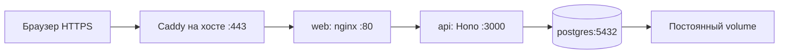

# ECHO: God Mode

Игра на веб-камере: записывай движения руки, создавай клонов и вместе с ними спасай человечка. Кампания из пяти уровней, обучение, процедурный звук и частицы.

**Играть: https://vencera.jeanark.dev**. Регистрация не нужна: гостевая сессия сохраняет результаты и прогресс на сервере. Вход по коду из письма привязывает почту и объединяет гостевые результаты с существующим аккаунтом.

## Управление

- Открытая ладонь — начать запись на 10 секунд.
- Щипок — схватить человечка, рычаг, щит или призму.
- Кулак — сбросить петлю (удерживать около пяти секунд; зависит от частоты кадров камеры).
- Указательный палец — выбрать уровень или кнопку HUD, удерживая курсор одну секунду.

Мышь и клавиатура нужны только для необязательного ввода почты, кода и ника. Видео обрабатывается MediaPipe Hands в браузере; сервер получает результаты, а не кадры камеры. Для первого запуска нужны интернет, разрешение камеры и HTTPS либо localhost.

## Уровни

1. **Призма и кристалл** — направь лазер в кристалл и открой дверь.
2. **Луч и щит** — клон защищает от движущегося лазера.
3. **Мульти-Эхо** — два клона удерживают рычаг и щит.
4. **Пропасть и мост** — клон держит мост у земли; отпущенный мост падает, а перенос над пропастью без опоры не работает.
5. **Два ключа** — два клона одновременно держат рычаги, пока игрок поднимает человечка к двери.

Подсказки объясняют промахи захвата, положение моста и недожатые рычаги. После победы показываются очки, лучший результат и топ-10; следующий уровень открывается через восемь секунд.

## Локальный запуск

Docker Engine + Compose:

```bash
cp .env.example .env
# Укажи случайный POSTGRES_PASSWORD в .env (openssl rand -hex 32).
docker compose up -d --build --wait
```

Открой http://127.0.0.1:8080. Запускаются **три отдельных контейнера**: `web` (nginx и собранный фронт), `api` (Node 22 + Hono), `postgres` (PostgreSQL 17). База хранится в volume `echo_pgdata`. Обычный `docker compose down` сохраняет данные; флаг `-v` удаляет их.

Без ключа Resend доступны гости, очки, прогресс и лидерборд. Для почты заполни `RESEND_API_KEY` и `MAIL_FROM` в корневом `.env`. В production используется `ECHO <echo@vencera.jeanark.dev>`. Секреты не попадают в образы и git.

Разработка с Vite и Node 22 вне Docker:

```bash
docker compose -f compose.test.yml up -d --wait
npm ci --prefix server
cp server/.env.example server/.env
npm run dev --prefix server
# Во втором терминале:
npm ci --prefix echo
npm run dev --prefix echo
```

Vite доступен на http://localhost:5173 и проксирует `/api` на `127.0.0.1:3000`. В этом варианте API использует отдельную локальную PostgreSQL на порту 55432. Её тестовый volume — tmpfs, данные исчезают при удалении контейнера. Для постоянных локальных данных используй основной Compose.

## Проверки

```bash
docker compose -f compose.test.yml up -d --wait
npm test --prefix echo
npm run build --prefix echo
npm run check --prefix server
npm test --prefix server
```

Тесты покрывают жесты, оптику, захват объектов, мост и два рычага, серверный расчёт очков, гостевой прогресс, лимит попыток кода, срок действия, cookie и слияние аккаунтов. Проверка настоящей камеры и прохождение человеком остаются отдельным ручным шагом.

## API и данные

Hono + PostgreSQL 17, пул из пяти соединений. Транзакции защищают запись результатов, слияние гостей и однократное использование кода. Cookie `echo_sid`: HttpOnly, SameSite=Lax, Secure в production, срок 30 дней. Токены сессий и коды хранятся как хеши. Код действует 10 минут, допускает пять попыток, отправка ограничена разом в минуту на адрес и общим лимитом.

Роуты: `/api/session`, `/api/me`, `/api/auth/request`, `/api/auth/verify`, `/api/auth/logout`, `/api/runs`, `/api/progress`, `/api/leaderboard`, `/api/health`. Точный контракт — [docs/08-implementation.md](docs/08-implementation.md).

Общая формула в `shared/score.ts`: `max(0, 1000 + round(timeLeftMs / 10) + (maxEchoes - echoesUsed) * 300 - deaths * 150 - resets * 50)`. Лидерборд суммирует лучшие результаты по уровням. Сервер пересчитывает очки и ограничивает метрики, но не проверяет воспроизведение игры: это не полноценная защита от читов.

## CI/CD и production

`push` в `main` запускает `.github/workflows/deploy.yml`:

1. **Test** — тесты фронта, TypeScript, API и миграции на настоящей PostgreSQL.
2. **Build** — отдельные Docker-образы `echo-web:<commit>` и `echo-api:<commit>`; затем проверка собранного стека с базой и гостевой сессией.
3. **Deploy** — образы доставляются по SSH на VM; делается `pg_dump`, Compose обновляет контейнеры и ждёт healthcheck. Если обновление не прошло, возвращаются предыдущие образы приложения.

Pull request запускает проверки и сборку без production-деплоя. Образы собираются на GitHub runner, а не на VM. Они передаются архивом, поэтому отдельный registry и его токен не требуются. Секреты GitHub прежние: `SSH_KEY`, `SSH_HOST`, `SSH_USER`, `SSH_KNOWN_HOSTS`.



Caddy сохраняет HTTPS и сертификаты. Только фронт опубликован на `127.0.0.1:8080`; API и PostgreSQL доступны внутри Docker-сетей. PostgreSQL не имеет публичного порта. На VM настроены лимиты памяти контейнеров и 1 ГБ swap.

Конфигурация и runtime-секреты: `/srv/echo/containers/.env` (права 600). Релиз: `/srv/echo/containers/.release`. PostgreSQL хранится в volume; образы и деплой не перезаписывают данные. Старый systemd API отключается после проверенного переноса SQLite. Инструкция миграции, бэкапа и отката — [docs/09-containers.md](docs/09-containers.md).

## Структура

- `echo/` — Vite + TypeScript + Canvas + MediaPipe Hands.
- `server/` — API, PostgreSQL, вход через Resend.
- `shared/` — формула очков и лимиты клонов.
- `deploy/` — Caddy, подготовка Docker, миграция данных и выпуск релизов.
- `docs/` — концепция, план реализации и материалы сдачи.
- Корневой `index.html` — исторический прототип; production собирается из `echo/`.

Основа — ветка `kebi`. Концепция «Эхо телом» из документов 01–04 запланирована отдельно; текущий релиз использует отслеживание кисти, а не Pose. L6 не входит в этот релиз.
