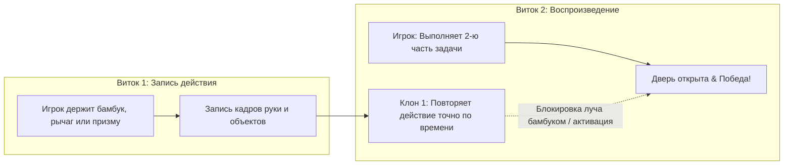

# ⏳ Vencera Echo Game

🌐 **Играть онлайн (Live Demo):** **[https://vencera.jeanark.dev](https://vencera.jeanark.dev)**

> **A webcam-only, spatial time-loop co-op puzzle game.** Built at ADMIT Hackathon 2026.
> Управляйте временем и пространством с помощью рук: создавайте призрачные клоны своих прошлых действий, решайте пространственные головоломки и спасайте персонажа в кооперативе с самим собой.

---

## 🚀 Быстрый запуск

### 🐳 Docker (в 2 команды)
```bash
cp .env.example .env
docker compose up --build
```
👉 Открыть в браузере: **[http://localhost:8080](http://localhost:8080)**

*Остановить:* `docker compose down`

---

### 💻 Локальный запуск (Node.js 22+)
```bash
cd echo
npm install
npm run dev
```
👉 Открыть в браузере: **`http://localhost:5173`**

---

## 🎮 Игровые Режимы: 2D & 3D

Проект предлагает два режима игры с единым бесконтактным управлением жестами:

1. **Классический 2D Режим (Spatial Time-Loop):**
   - Собственный легковесный Canvas 2D движок с детерминированной физикой и записью временных петель.
   - Три уровня с лазерами, призмами, рычагами и бамбуком для блокировки луча; панда с анимациями на каждом уровне.
2. **Экспериментальный 3D Режим (Three.js Laboratory):**
   - Полноценная 3D-лаборатория на Three.js с динамическим освещением, тенями и процедурной анимацией маскота Панды.
   - Манипуляция 3D-призмами и пространственными объектами жестами рук (Pinch, Dwell, Rotation).

---

## 🖐️ Управление и Жесты (21 3D-Landmark)

Весь интерфейс (меню, уровни, настройки, пауза) управляется **руками без мыши**:

| Жест | Иконка | Роль в игре | Описание распознавания |
| :--- | :---: | :--- | :--- |
| **Открытая ладонь** | 🖐️ | Старт витка / запись | Все пальцы выпрямлены выше суставов |
| **Щипок (Pinch)** | 🤏 | Захват и перенос объектов | Евклидово расстояние между большим и указательным `< 0.08` |
| **Кулак (Fist)** | ✊ | Перезапуск витка (удерживать 0.7 с) | Все кончики пальцев прижаты к ладони; круговой индикатор сброса |
| **Указательный палец** | 👆 | Курсор и клик интерфейса | Указательный выпрямлен. Наведение и удержание (Dwell) 1.0 с = клик |



---

## 🧠 Режим «Ошибка» & Подсказки

Приложение непрерывно анализирует движение игрока и выводит контекстную помощь:
1. **Направление к цели:** алгоритм определяет вектор смещения до интерактивного объекта и подсказывает направление (*«Сдвиньте руку правее / левее / выше / ниже»*).
2. **Анатомия пальцев:** система определяет невыпрямленные пальцы (*«Выпрямите пальцы: указательный, средний...»*).
3. **Границы кадра & Статус:** отображение статуса доступа к камере, загрузки модели нейросети и предупреждений при потере рук из кадра.

---

## 🛠️ Техническая Архитектура

- **Real-time Computer Vision:** MediaPipe Hands (21 3D-landmarks) с детерминированным буфером интерполяции движений.
- **Графические рендереры:** Высокопроизводительный Canvas 2D движок + Three.js WebGL 3D лаборатория.
- **Интегрированная Lo-Fi музыка & Звуки:** процедурные аудиоэффекты (Web Audio API) + музыкальный плеер с ползунком громкости (0–100%) в настройках.
- **Full-Stack & Docker:** Vite фронтенд, Node.js + Hono API сервер, PostgreSQL для хранения сессий и лидерборда.

---

## 👥 Команда и разработка
Создано специально для хакатона Admit 2026.
