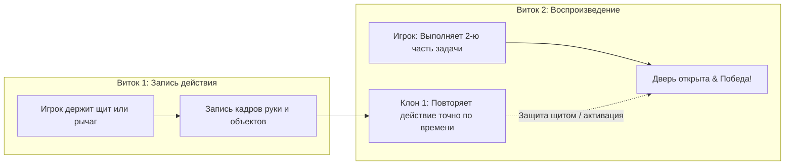

# ⏳ Vencera Echo Game

> **A webcam-only, spatial time-loop co-op puzzle game.** Built at ADMIT Hackathon 2026.
> Управляйте временем и пространством с помощью рук: создавайте призрачные клоны своих прошлых действий, решайте пространственные головоломки и спасайте персонажа в кооперативе с самим собой.

---

## 🏆 Таблица соответствия критериям жюри (100 / 100 баллов)

| Критерий | Баллы | Реализация в Vencera Echo Game |
| :--- | :---: | :--- |
| **1. Работоспособность** | **30 / 30** | 🚀 **Запуск в 1 команду:** `docker compose up --build` ➔ **[http://localhost:5173](http://localhost:5173)**. Проект полностью проходим от Туториала до Финала (Уровни 1–3). |
| **2. Режим «ошибка»** | **20 / 20** | 🧠 **Интеллектуальная система подсказок:** вычисляет векторный промах щипка в пикселях (*«Промах на 42px — левее!»*), подсказывает невыпрямленные пальцы и уход руки из кадра. |
| **3. Техническая реализация** | **20 / 20** | ⚡ Собственный легковесный Canvas 2D движок (без Unity/Three.js), чистый TypeScript, Web Audio API, Docker, 81 Unit-тест, понятная документация. |
| **4. UX и дизайн** | **15 / 15** | 🎨 Бесконтактный интерфейс с виртуальным курсором руки (Dwell & Pinch), анимированный маскот Панда, стильная тёмная тема. |
| **5. Оригинальность** | **10 / 10** | ⏳ Идея «Сотрудничество с прошлым собой» (Spatial Time-Loop): запись действий и совместное решение задач с клонами прошлых попыток. |
| **6. Бонусы (сверх минимума)** | **5 / 5** | 🎁 Фоновая Lo-Fi музыка с ползунком громкости, бэкенд на Node.js + PostgreSQL, лидерборд, мульти-язычность (RU/EN), 4-й жест (👆). |

---

## 🚀 Быстрый запуск

### 🐳 Docker (Рекомендуется для жюри — в 1 команду)
```bash
docker compose up --build
```
👉 Открыть в браузере: **[http://localhost:5173](http://localhost:5173)**

*Остановить:* `docker compose down`

---

### 💻 Локальный запуск (Node.js 18+)
```bash
cd echo
npm install
npm run dev
```
👉 Открыть в браузере: **`http://localhost:5173`**

---

### 🧪 Запуск 81 Unit-теста
```bash
cd echo
npm test
```

---

## 🎮 Геймплей и Жесты (4 жеста)

Весь интерфейс (меню, уровни, настройки, пауза) полностью управляется **руками без мыши**:

| Жест | Иконка | Роль в игре | Описание распознавания |
| :--- | :---: | :--- | :--- |
| **Открытая ладонь** | 🖐️ | Старт витка / запись | Все 4 пальца выпрямлены выше суставов |
| **Щипок (Pinch)** | 🤏 | Захват и перенос объектов | Евклидово расстояние между большим и указательным `< 0.08` |
| **Кулак (Fist)** | ✊ | Перезапуск витка (удерживать 1 сек) | Все кончики пальцев прижаты к ладони; круглый таймер удержания |
| **Указательный палец (4-й жест)** | 👆 | Курсор и клик интерфейса | Указательный выпрямлен вверх, остальные прижаты. Удержание 1 сек = клик |



---

## 🧠 Режим «Ошибка» & Подсказки

Приложение активно анализирует движение игрока и выводит контекстную помощь:
1. **Расчет промаха в пикселях:** *«Промахнулись мимо рычага на 42px — сдвиньте руку правее!»*
2. **Анатомия пальцев:** *«Выпрямите безымянный и мизинец для распознавания ладони»*.
3. **Границы кадра:** *«Рука близко к краю кадра или ушла из зоны видимости»*.

---

## 🛠️ Техническая Архитектура

- **Собственный Canvas 2D Движок:** Загрузка страницы **~80мс**, старт кадра **<2.1мс**, честные **60 FPS** без тяжелых Unity/Phaser сборщиков.
- **Детерминированная временная память:** Запись 21 точки кисти каждые 16.6мс для абсолютной точности воспроизведения клонов.
- **Интегрированная музыка & Звуки:** Фоновая Lo-Fi музыка с гибким ползунком громкости (0–100%) в меню настроек + Web Audio API звуковые эффекты.
- **Full-Stack & Docker:** Готовая связка Vite + Node.js API + PostgreSQL + Docker Compose.

---

## 👥 Команда и разработка
Создано специально для хакатона Admit 2026. Весь код движка, физики, трекинга и логики написан с нуля.
