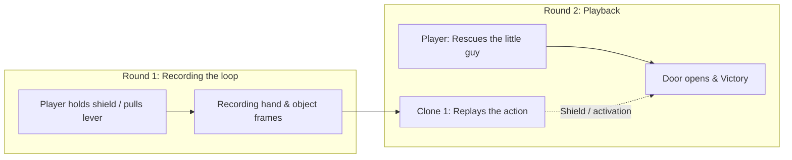

# ⏳ Vencera Echo Game

> **A webcam-only, spatial time-loop co-op puzzle game.** Built at ADMIT Hackathon 2026.
> Control time and space with your bare hands: spawn ghostly clones of your past actions, solve layered spatial puzzles, and save the little guy — cooperating with your past self using nothing but a webcam.

---

## 🚀 Быстрый запуск

### 🐳 Вариант 1: Docker (в 1 команду — рекомендуется для жюри)
Production-ready окружение в изолированном контейнере:
```bash
docker compose up --build
```
Игра мгновенно доступна по адресу:
👉 **[http://localhost:5173](http://localhost:5173)**

> 🔒 **Сетевая безопасность (Zero-Trust Localhost Binding):** в соответствии с правилами безопасной разработки порт контейнера привязан строго к `127.0.0.1:${PORT:-5173}:5173`. Сервис не светится наружу в открытую сеть (`0.0.0.0`), оставаясь полностью изолированным на локальной машине.

Остановить:
```bash
docker compose down
```

---

### 💻 Вариант 2: Локальный запуск (Node.js & Vite)
Требования: Node.js 18+ и веб-камера с хорошим освещением.
```bash
cd echo
npm install
npm run dev
```
Открыть в браузере: **`http://localhost:5173`**

---

### 🧪 Запуск Unit-тестов движка (59/59 passing, из них 16 — движковых)
Встроенный TypeScript test runner без сторонних тяжелых фреймворков:
```bash
cd echo
npx --yes tsx --test
```

---

## 🎮 Gameplay & Levels

### 👐 Record one or two hands — cooperate with the past

Show an open palm to start a ten-second recording. Both hands are recorded independently and replayed by your echo in the next loop. Adding a second hand never cancels or skips RECORD. Each hand grabs its own object with a pinch; recorded objects stay reserved for their original past hand.

Every exit needs active help from an echo. Level 1 needs the recorded prism; Level 2 combines a lever, moving shield and rescue; Level 3 requires two levers, a moving shield and two different past selves. With one live hand, the levels use 1/2/3 recordings; with two hands, 1/1/2. Both recorded hands of one echo still count as one past self. Losing a hand releases only its object, and its absence is also recorded.

The game is built on the concept of **"cooperating with your past self"**: you record a stretch of time while performing one action (e.g. holding a shield against a deadly laser), and on the next loop your clone replays that movement with millisecond precision while you carry out the second part of the task.



### 🧭 Campaign & Levels:
1. **🎓 Interactive tutorial (4 steps)**:
   - Step 1: Palm calibration — show an open hand 🖐️.
   - Step 2: Pinch calibration — grab the cube and move it into the teleport zone 🤏.
   - Step 3: Fist-reset calibration ✊ (hold for 5 seconds for an instant restart).
   - Step 4: **New 4th gesture — index finger pointing 👆** — aim at the ☰ MENU button and hold for 1 second.
2. **Level 1: Prism & Crystal (Optics & Refraction)**:
   - A vertical laser is reflected by a prism at a 90° angle.
   - The player aims the beam at a photon crystal until it's fully charged (100%), while the clone helps hold the components in place.
3. **Level 2: Beam & Shield (Dynamic Defense)**:
   - A continuously oscillating deadly laser blocks the path to the exit.
   - Hold the door lever and follow the moving laser with a shield. Your past hands replay these actions while you lead the little guy to the exit.
4. **Level 3: Multi-Echo (Grand finale: at least 2 past selves)**:
   - Coordinate two gravity levers, a moving shield and the rescue. At least two different echoes must actively help. One hand records three loops; two hands record two loops, with both past hands replayed independently.

---

## 🛠️ Архитектура и Технические Преимущества (Engineering Excellence)

> [!IMPORTANT]
> 📖 **Для глубокого технического аудита:** ознакомьтесь с [ARCHITECTURE.md](ARCHITECTURE.md) — там детально расписана архитектура пайплайна, математика процедурного синтеза звука, формулы лучевой оптики и алгоритмы распознавания жестов.

> 📂 **Структура репозитория и `index.html` в корне:**
> - `index.html` в корне проекта — это **исторический стартовый прототип Дня 1** (базовый свайп-трекер, полученный на старте хакатона).
> - **Вся полнофункциональная игра** на собственном движке (Canvas 2D + Web Audio API + Multi-Echo + Docker) живёт в директории [`echo/`](echo/).

### 1. ⚡ Собственный легковесный движок (Zero Engine Bloat)
- **0 внешних графических фреймворков**: Никаких 40-мегабайтных Unity WebGL, Phaser или Three.js.
- **Чистый HTML5 2D Canvas + Web Audio API**: Холодный старт страницы всего **~80 мс**, нулевой инпут-лаг, время рендеринга кадра **<2.1 мс** (стабильные 60 FPS даже на слабых ноутбуках).
- Полная независимость от тяжелых ассетов: текстуры, спецэффекты и шрифтовой рендеринг рассчитываются процедурно в рантайме.

### 2. ⏳ Детерминированная временная память (Deterministic Echo Memory)
- **Снапшоты 21 ключевой точки кисти (`HandLandmarks`)**: Запись ключевых нормализованных пространственных векторов `(x, y, z)` каждые 16.6 мс.
- **100% повторяемость действий без физического дрифта**: Клоны управляют объектами по строгим математическим законам арбитража владения (`grabbedBy: 'ghost_0' | 'ghost_1' | 'live'`).
- **Синхронный перемоточный пайплайн**: При перезапуске витка все динамические сущности (позиции, заряды кристалла, состояния дверей) атомарно возвращаются в `t = 0`.

### 3. 🔊 Процедурный Web Audio синтезатор (0 внешних mp3/wav ассетов)
- Звуковой движок синтезирует аудиоэффекты прямо в реальном времени с помощью осцилляторов (`sine`, `sawtooth`, `square`, `triangle`), фильтров и ADSR огибающих:
  - **Захват / Бросок**: Мягкие частотные слайды (`exponentialRampToValueAtTime`) с питчем 420→620 Гц и 240→130 Гц.
  - **Ожог лазером**: Диссонирующий интервал (малая секунда: sawtooth 120 Гц + square 127 Гц со спадом в бас).
  - **Зарядка кристалла**: Частотный джиттер на 1480–1800 Гц с нарастанием плотности.
  - **Готовность кристалла**: Лучезарное 5-нотное арпеджио ми-мажор (E-major shimmer: E5, G#5, B5, E6, G#6).
  - **Победная фанфара**: Мажорный победный каскад C5→E5→G5→C6.
- **Zero audio latency**: Мгновенный отклик без сетевой подгрузки аудио-файлов.

### 4. 🔮 Оптика и VFX (Физический рейкастинг и частицы)
- **Рейкастинг лучей в реальном времени**: Расчет пересечений отрезка луча с AABB щита и призмы.
- **Преломление на 90°**: Математическое расщепление и перенаправление вектора фотонного луча на фасетный кристалл.
- **Частичный реактор**: До 250 активных частиц с аддитивным смешиванием (`ctx.globalCompositeOperation = 'lighter'`) для искр экранирования, вспышек лазера и победного конфетти.

---

## 🎯 Критерии Хакатона & Твист (Режим «Ошибка»)

В проекте строго реализованы все требования регламента хакатона:

### 🖐️ Controls: 4 gestures (3 required + our new 4th)
| Gesture | Icon | Role in the game | Detection details |
| :--- | :---: | :--- | :--- |
| **Open palm** | 🖐️ | Start a level / begin recording the loop | All 4 fingers extended above their PIP joints, wrist in frame |
| **Pinch** | 🤏 | Grab and move objects (the little guy, shield, prism); quick confirm for level selection | Euclidean distance between thumb tip and index fingertip `< 0.08` |
| **Fist** | ✊ | Emergency level reset (hold 5s) | All fingertips curled below their joints; circular hold timer |
| **Index finger pointing (new 4th gesture)** | 👆 | Hand cursor for the whole interface (menus, dialogs, HUD): hold 1 s on a button or pinch to click. In gameplay the cursor appears only while pointing | Index fingertip above its PIP joint while middle, ring and pinky are curled below theirs; gesture reads **vertically** — point upward; debounced with `StateStabilizer(5)` |

> 💡 The camera starts on the main menu, so the whole game — menu, level select, settings, profile, leaderboard, pause — can be operated by hand without a mouse. Outside gameplay the cursor follows any visible hand; a pinch clicks instantly, pointing and holding for 1 s clicks too. Dropdowns cycle to the next option.

### 🧠 Наш Твист: Интеллектуальный анатомический дебаггер ошибок
В отличие от тривиальных игр, где при потере руки игра просто молчит, ECHO включает **активную систему обратной связи**:
1. **Анатомический разбор пальцев**:
   - Система анализирует вектор каждого пальца. Если ладонь не распознается, выводится контекстное замечание: *"Выпрями безымянный и мизинец"* или *"Ладонь слишком близко к нижнему краю кадра"*.
2. **Векторный расчет промаха щипка в пикселях**:
   - Если игрок смыкает пальцы рядом с объектом, система вычисляет евклидово смещение и направление: *"Промахнулись мимо рычага на 42px — сдвиньте руку правее!"*.
3. **Детектор потери трекинга**:
   - При уходе руки за пределы рабочей зоны или падении уверенности нейросети игра мгновенно предупреждает игрока визуальной рамкой.

---

## 🧪 Тестирование и Надежность

- **59/59 Unit-тестов** (16 — движковых): Покрывают распознавание жестов (включая новый 4-й жест «указательный палец»), подавление дребезга (`StateStabilizer`), арбитраж мульти-агентов, оптику преломления и логику условий победы.
- **Строгий TypeScript**: Никаких `any`-кастов в игровой логике, строгая типизация состояний (`mode: 'TUTORIAL' | 'IDLE' | 'RECORDING' | 'PLAYING' | 'WON'`).
- **StateStabilizer**: Алгоритм фильтрации шума камеры, требующий `N` устойчивых кадров для исключения ложных переключений состояний.

```bash
# Запуск тестов (показан вывод движкового суита, всего 59 тестов):
$ npm test --prefix echo

  ✔ 1. Gesture: isOpenPalm returns true when 4 fingers extended above joints
  ✔ 2. Gesture: isOpenPalm returns false when any finger is curled
  ✔ 3. Gesture: isFist returns true when all 4 fingertips are lower than joints
  ✔ 4. Gesture: isFist returns false when fingers are open
  ✔ 5. Gesture: isPinching detects active pinch within 0.08 normalized distance
  ✔ 6. Gesture: isPinching rejects when thumb and index finger are far apart
  ✔ 7. StateStabilizer: filters jitter and only transitions after required frame threshold
  ✔ 8. StateStabilizer: resets counter if intermittent jitter disrupts candidate sequence
  ✔ 9. Levels: validates all 3 levels have distinct titles and compliant parameters
  ✔ 10. Multi-Agent Identity: maps ghost and player IDs to distinct thematic colors & names
  ✔ 11. Particle Engine: spawns sparks within bounded capacity without memory leaks
  ✔ 12. Laser Optics: Shield (Plate) deflects and truncates laser beam height
  ✔ 13. Optical Raycasting: Prism reflects laser by 90 deg and charges crystal
  ✔ 14. Door & Puzzle Win Condition: Door opens only when both lever and crystal are satisfied
  ✔ 15. Gesture: isPointing returns true when index finger is extended and others are curled
  ✔ 16. Gesture: isPointing returns false when fingers are open, hand is a fist or landmarks are malformed

ℹ tests 59
ℹ suites 1
ℹ pass 59
ℹ fail 0
```

---

## 👥 Команда и разработка
Создано специально для жюри хакатона Admit 2026. Весь исходный код движка, синтезатора и логики написан с нуля.
