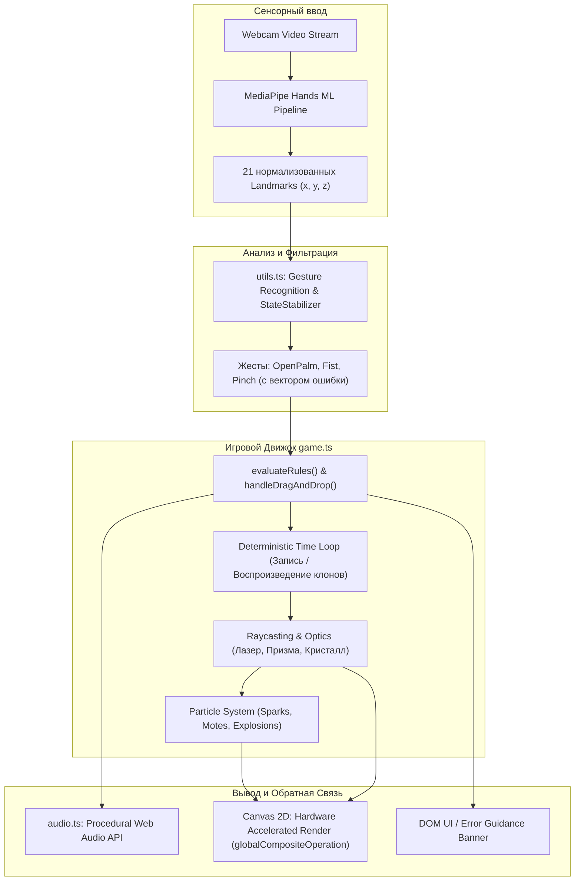
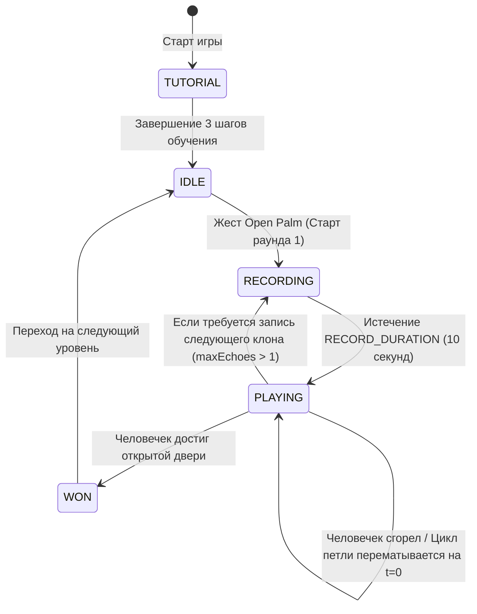
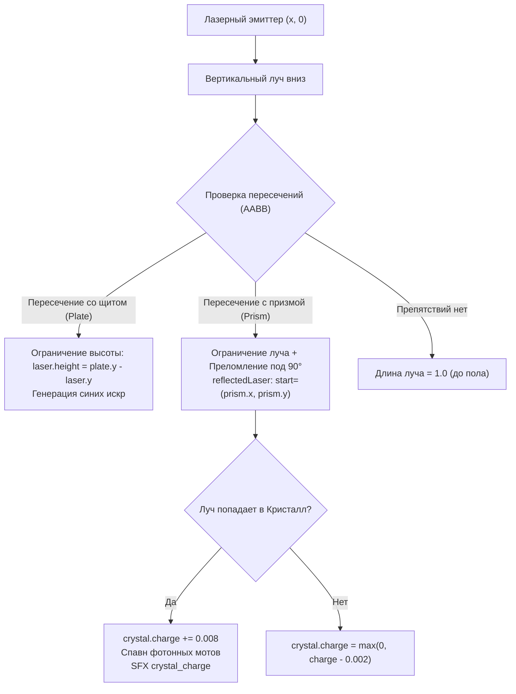

# 🏛️ Архитектура движка ECHO (Deep Dive Engine Architecture)

Документ содержит подробный технический разбор архитектурных решений, математического аппарата и внутренних пайплайнов проекта **ECHO: God Mode**.

---

## 1. Обзор системы и Поток Данных (Data Flow)

Движок спроектирован по принципу **Data-Driven Unidirectional Loop** (однонаправленный поток данных) без использования тяжелых сторонних игровых фреймворков. Это обеспечивает холодный старт за ~80 мс и частоту кадров 60 FPS с расходом <2.1 мс на кадр.



### Модульная структура:
- **[`src/main.ts`](file:///home/kebi/proga/Kebi/admit-hackathon-2026/echo/src/main.ts)**: Инициализация MediaPipe Camera/Hands, игровой цикл `onResults()`, синхронизация ресайза канваса и переключение уровней.
- **[`src/utils.ts`](file:///home/kebi/proga/Kebi/admit-hackathon-2026/echo/src/utils.ts)**: Математика векторного распознавания жестов, дебаунсер состояний `StateStabilizer`, незеркальный рендеринг текста.
- **[`src/game.ts`](file:///home/kebi/proga/Kebi/admit-hackathon-2026/echo/src/game.ts)**: Ядро игровых правил, временная память клонов, коллизии AABB/рейкастинг, физика частиц, арбитраж объектов.
- **[`src/audio.ts`](file:///home/kebi/proga/Kebi/admit-hackathon-2026/echo/src/audio.ts)**: Процедурный синтезатор звуковых эффектов на Web Audio API без внешних аудио-файлов.
- **[`src/levels.ts`](file:///home/kebi/proga/Kebi/admit-hackathon-2026/echo/src/levels.ts)**: Декларативная конфигурация уровней кампании.
- **[`src/types.ts`](file:///home/kebi/proga/Kebi/admit-hackathon-2026/echo/src/types.ts)**: Строгая TypeScript типизация сущностей и состояний конечного автомата.

---

## 2. Детерминированная временная петля (Deterministic Playback Loop)

Ключевая механика игры — запись действий игрока в первом витке времени и воспроизведение их призрачными клонами в последующих витках.

### Конечный автомат состояний (State Machine):


### Структура кадра временной памяти (`Frame Snapshot`):
Каждый кадр (~60 раз в секунду) в режиме `RECORDING` сохраняет легковесный снапшот:
```typescript
interface RecordedFrame {
    landmarks: Point3D[];      // 21 точка кисти MediaPipe
    pinch: boolean;            // Состояние сжатия щипка
    pointer: { x: number, y: number }; // Нормализованные координаты щипка
    timestamp: number;         // Относительное время кадра от старта записи
}
```

### Арбитраж владения объектами (`Multi-Agent Object Arbitration`):
Чтобы предотвратить физический дрифт и конфликты одновременного захвата объекта живым игроком и клонами, используется строгий приоритетный арбитраж:
```typescript
export interface Entity {
    x: number;
    y: number;
    grabbedBy: string | null; // 'live' | 'ghost_0' | 'ghost_1' | null
}
```
1. Если объект захвачен агентом `agentId`, координаты объекта строго привязываются к координатам указательного пальца/щипка этого агента с учетом оффсета.
2. Когда агент разжимает щипок (`pinch === false`), владение мгновенно сбрасывается (`grabbedBy = null`).
3. При перезапуске петли (`t = 0`) все динамические сущности восстанавливают свои начальные позиции из `LEVELS[currentLevel - 1]`.

---

## 3. Математика процедурного Web Audio синтеза

В ECHO **0 килобайт внешних аудио-файлов**. Все звуки синтезируются в реальном времени через веб-аудио узлы (`AudioContext`, `OscillatorNode`, `GainNode`). Это исключает задержки ввода/вывода, проблемы с CORS и асинхронную подгрузку ассетов.

### Применяемые формулы и звуковые сигнатуры:

#### А. Захват (`grab`) и Бросок (`drop`)
Плавное изменение частоты с экспоненциальным затуханием амплитуды:
$$f(t) = f_0 \cdot \left(\frac{f_1}{f_0}\right)^{\frac{t - t_0}{\Delta t}}$$
$$A(t) = A_0 \cdot e^{-k(t - t_0)}$$

- **Grab**: $f_0 = 420\text{ Гц} \to f_1 = 620\text{ Гц}$, $\Delta t = 0.08\text{ с}$, тип волны `sine`.
- **Drop**: $f_0 = 240\text{ Гц} \to f_1 = 130\text{ Гц}$, $\Delta t = 0.07\text{ с}$, тип волны `sine`.

#### Б. Ожог лазером (`burn`) — Диссонирующая бигармония
Для создания эффекта электрической дуги и опасности синтезируются два расстроенных осциллятора с интервалом малой секунды (диссонанс):
- Осциллятор 1: `sawtooth`, $120\text{ Гц} \to 45\text{ Гц}$.
- Осциллятор 2: `square`, $127\text{ Гц} \to 42\text{ Гц}$.
Разность частот $\Delta f \approx 7\text{ Гц}$ создает агрессивные биения в басовом регистре, подчеркивающие контакт с фатальным лучом.

#### В. Зарядка и Готовность кристалла (`crystal_ready`)
При полной зарядке кристалла генерируется каскад из 5 гармонических обертонов с интервалом 60 мс (аккорд E-major Shimmer):
$$f_i \in \{ 659.25\text{ (E5)}, 830.61\text{ (G#5)}, 987.77\text{ (B5)}, 1318.51\text{ (E6)}, 1661.22\text{ (G#6)} \}$$
Каждая нота имеет быструю атаку (15 мс) и протяженный экспоненциальный спад (450 мс), создавая хрустальное сияние.

#### Г. Победный триумф (`win`)
Арпеджио в тональности До-мажор: C5 (523.25 Гц) $\to$ E5 (659.25 Гц) $\to$ G5 (783.99 Гц) $\to$ C6 (1046.50 Гц).

---

## 4. Оптика, Рейкастинг и Система Частиц

### 1. Рейкастинг и Преломление лучей (Raycasting & 90° Refraction)
Лазерный луч моделируется как направленный сегмент от источника $(x_0, y_0)$ до точки поглощения или экрана:



### 2. Математика плавающего кристалла (Floating Oscillation):
Кристалл левитирует в пространстве по гармоническому закону:
$$y_{\text{effective}}(t) = y_{\text{base}} + A \cdot \sin(\omega t)$$
где $A = 0.012$ (нормализованная высота), $\omega = 3.0\text{ рад/с}$. Это требует от игрока и клона точного позиционирования призмы по вертикали.

### 3. Высокопроизводительный пул частиц (Particle Pool):
- Пул с жестким потолком `MAX_PARTICLES = 250` предотвращает аллокацию памяти в рантайме и срабатывание Garbage Collector.
- Смешивание цветов через `ctx.globalCompositeOperation = 'lighter'` производит аддитивное свечение (неоновый глоу-эффект) без затратных шейдеров пост-процессинга.
- Каждый кадр частицы обновляют кинематику:
  $$\vec{x}_{t+1} = \vec{x}_t + \vec{v}, \quad \alpha_{t+1} = \alpha_t - \delta_{\text{decay}}$$

---

## 5. Алгоритмы анализа жестов и анатомической обратной связи

### Детекция щипка (Pinch):
Евклидово расстояние между кончиком большого пальца ($P_4$) и кончиком указательного ($P_8$):
$$D_{\text{pinch}} = \sqrt{(x_4 - x_8)^2 + (y_4 - y_8)^2}$$
Щипок активен, если $D_{\text{pinch}} < 0.08$.

### Расчет промаха щипка (Твист-дебаггер):
Если $D_{\text{pinch}} < 0.08$, но ни один интерактивный объект не захвачен, алгоритм ищет ближайшую цель $E_i$:
$$\Delta x = E_{i}.x - x_{\text{pointer}}, \quad \Delta y = E_{i}.y - y_{\text{pointer}}$$
$$\text{dist}_{px} = \sqrt{\Delta x^2 \cdot W^2 + \Delta y^2 \cdot H^2}$$
Если $\text{dist}_{px} \le 120\text{ px}$, пользователю немедленно выводится направляющая подсказка:
- $\Delta x > 0 \implies$ *"Сдвиньте руку правее на N px"*;
- $\Delta x < 0 \implies$ *"Сдвиньте руку левее на N px"*.

---

## 6. Тестирование и Валидация (Quality Assurance)

Архитектурная чистота подтверждается 14 unit-тестами, изолированными от браузерного окружения:
- Запуск: `(cd echo && npx --yes tsx --test)`
- Тестируемые компоненты: распознавание жестов, подавление дребезга `StateStabilizer`, конфигурации 4 уровней, мульти-агентная идентификация, ограничение емкости пула частиц, рейкастинг и условия открывания дверей.
